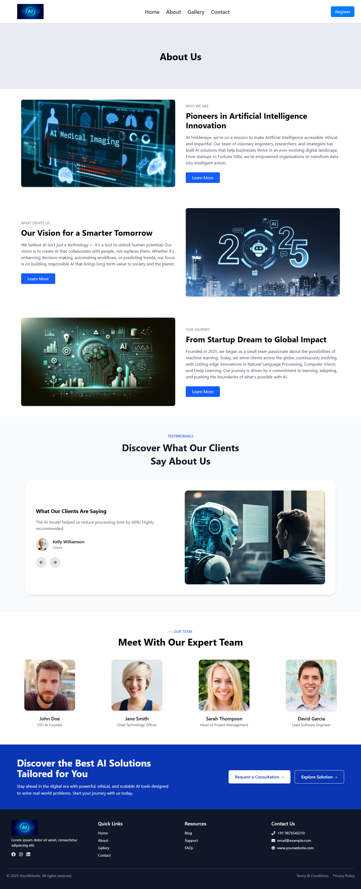

# 🤖 AI Website - Modern Responsive Web App

A sleek and modern AI-themed website built using React and Tailwind CSS. This project showcases artificial intelligence services, case studies, testimonials, blogs, pricing plans, and a fully functional contact form connected to MongoDB using a Node.js and Express backend.

## 📌 Features

- ✨ Beautiful and responsive homepage layout
- 💡 Hero section with AI tagline and CTA
- 🧠 About section with company mission and vision
- 📦 Service features displayed in icon boxes
- 📊 Case studies with links
- 💳 Pricing plans (Basic, Standard, Premium)
- 🗣️ Testimonials carousel
- 📝 Latest AI blog articles
- 📬 Fully functional contact form (stores data in MongoDB)
- 📤 Backend API integration (Express + Mongoose)

---

## 🛠️ Tech Stack

**Frontend:**

- React.js
- Tailwind CSS
- Axios

**Backend:**

- Node.js
- Express.js
- MongoDB (Mongoose)
- Dotenv

## 📸 Screenshots

### 🏠 Home Page

### 📖 About Page

### 🖼️ Gallery Page

### ✉️ Contact Page

## 🗂️ Pages in the Website

- 🏠 **Home** – Landing page with all sections
- 📖 **About** – Learn about our mission and services
- 🖼️ **Gallery** – Visual showcase or portfolio
- ✉️ **Contact** – Submit inquiries (stored in MongoDB)
